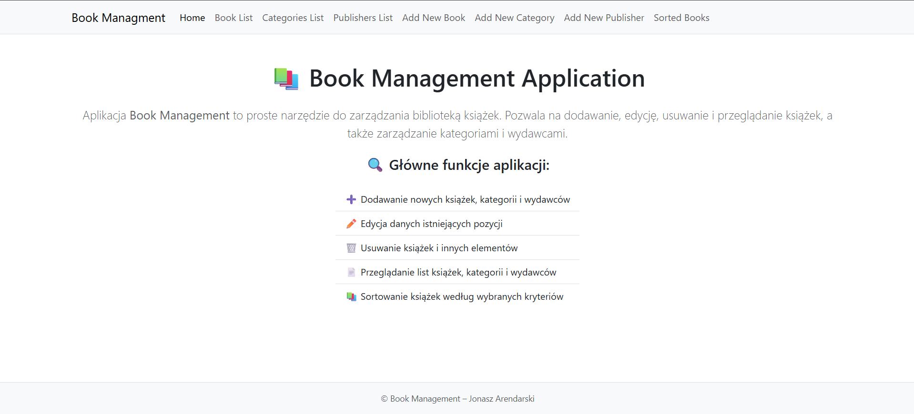
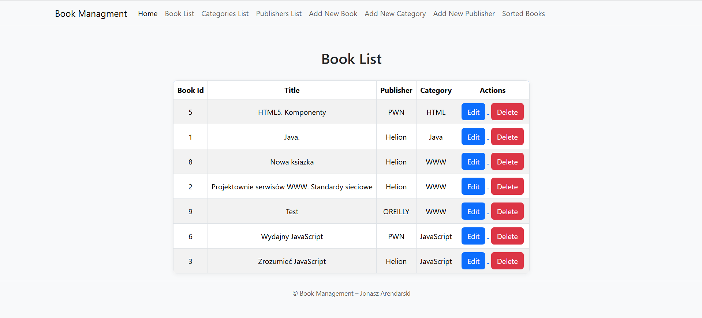
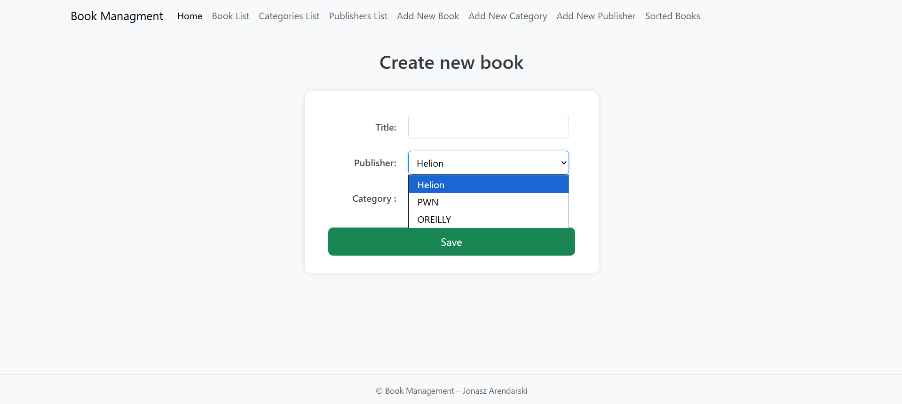

# 📚 BookManager

**BookManager** to aplikacja służąca do zarządzania książkami.  
Pozwala w prosty sposób **dodawać, edytować, usuwać** oraz **przeglądać** pozycje w bibliotece.

---

## 🚀 Funkcje

- ➕ Dodawanie nowych książek  
- ✏️ Edytowanie istniejących pozycji  
- 🗑️ Usuwanie książek  
- 📖 Przeglądanie listy książek  

---

## 🖼️ Podgląd działania aplikacji

| Ekran główny | Lista książek | Dodawanie książki |
|---------------|----------------|--------------------|
|  |  |  |

---

## 🧩 Użyte technologie

Aplikacja została stworzona w oparciu o **Spring Boot** z wykorzystaniem następujących technologii:

- 🧠 **Thymeleaf** — silnik szablonów do generowania widoków  
- 🗄️ **PostgreSQL** — relacyjna baza danych  
- ⚙️ **Spring Data JPA** — warstwa dostępu do danych  
- 🌐 **Spring MVC** — obsługa żądań HTTP i logiki kontrolerów  

---

## ⚙️ Instalacja i konfiguracja

### 1. Sklonuj repozytorium

```bash
git clone https://github.com/JonaszArendarski/BookManager.git
```

### 2. Ustaw Parametry PostgreSQL
    ```
    # parametry poziomu logowania/raportowania aplikacji
    logging.level.org.springframework=ERROR
    spring.sql.init.mode=always
    # parametry dla PostgreSQL
    spring.sql.init.platform=postgres
    spring.jpa.properties.hibernate.default_schema=<YOUR_SCHEMA>
    spring.datasource.url=jdbc:postgresql://<YOUR_HOST>:5432/<DATABASE_NAME>
    spring.datasource.username=<USERNAME>
    spring.datasource.password=<PASSWORD>
    # parametry dla JPA
    spring.jpa.hibernate.ddl-auto=update
    ```
    
### 3. Uruchom aplikacje
   Po Uruchomieniu usuń plik
   ```
   data.sql
   ```
   Plik służy jedynie dopisaniu wartości testowych    
